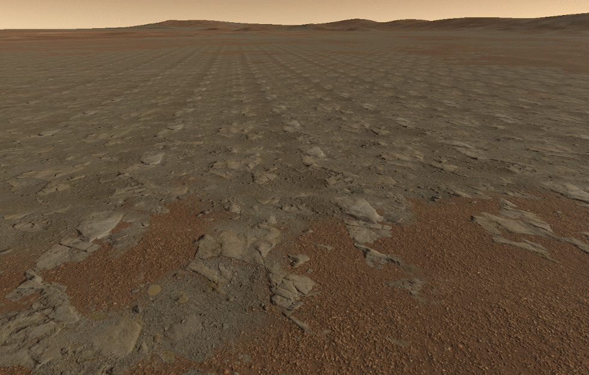
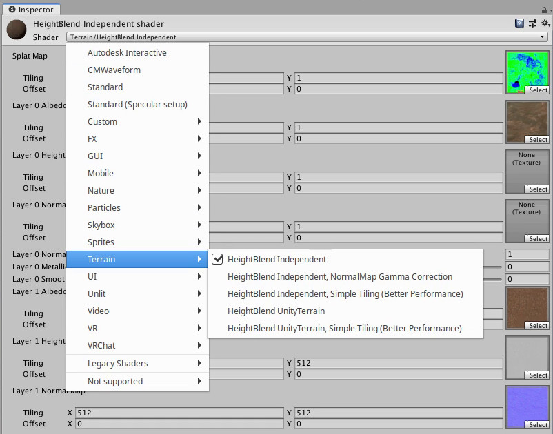
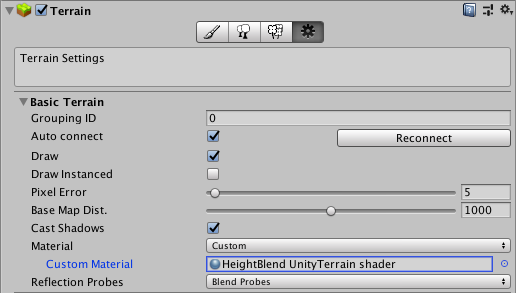

# Unity Terrain Shader with Height Blending and more features

## About
This shader is meant to be used on terrains, providing features additional to the standard Unity Terrain shader.  
Those features were developed especially with a use case of large and sparse landscapes in mind but can also be useful in other cases.

&nbsp;
## Features
### Height Blend
In order to achieve a more realistic appearance the blending between different terrain textures is done based on height information.  
For example sand can go in the cracks between stones this way:

The Property "Height Blend Overlap Depth" defines an overlapping distance where the default linear blending behavior will be used.  
This is useful to smooth out the boarders between the different textures.

&nbsp;
### Avoid Texture Tile Repetition
On larger terrains, especially if they are sparse, it is difficult to avoid a distracting appearance of texture tile repetition.  
To solve this problem, this shader uses an algorithm developed by Inigo Quilez to randomize orientation and offset of the texture tiles.

&nbsp;
### Distant Map
On large terrains there is still the problem that from a distant view point the individual textures can become visible as blots of colors, leaving an otherwise featureless landscape.  
Therefore this shader offers to use a separate larger scale map that will be blended in based on distance to the viewer.

The property "Distant Map Blend Distance" controls the distance at which the large scale map will start to blend in.  
"Distant Map Influence Min" can be set to always have a minimum amount of the large scale map visible to provide a bit more variety even from up close.  
With "Distant Map Influence Max" the maximum visibility of the large scale map can be reduced to always leave some of the detailed textures visible.

&nbsp;
### Parallax
The available height information will also be used to create a parallax 3D effect.  
This can be controlled using the "Parallax Height" property.

&nbsp;
## Installation
To use this shader in your project, simply drop the .shader and .cginc files into your project in any place you like.  
The variants of this shader will then be available to be selected in a material inspector:

&nbsp;
## Variants

### "UnityTerrain" variants
The "UnityTerrain" variants are meant to work as a drop-in replacement for the standard Unity Terrain shader.  
While all other variants only support 4 texture layers, the "UnityTerrain" variants can use more than that, just like the standard Unity Terrain shader.  
Though, only the first 4 layers will provide the additional the features of this shader.  
All standard texture maps are set in the Terrain Layers of the Terrain object as usual.  
The additional height maps and settings are available in the inspector panel of the material.

To apply this shader to a Terrain Object, a Material using this shader must be created.  
In the Terrain Object that material can then be set as a "Custom Material" in the "Terrain Settings".

&nbsp;
### "Independent" variants
In contrast to the "UnityTerrain" variants, the "Independent" variants can be used on simple meshes.  
Here all texture maps and settings are available in the inspector panel of the material.  
This also allows to use any texture as a "Splat Map" to control where the individual layers appear.  
Thus the Splat map can be prepared externally and imported into Unity instead of needing to draw it manually inside of Unity.  
The alpha channel of the Albedo Maps will act as Smoothness Maps.

&nbsp;
### "NormalMap Gamma Correction"
Since the shader will flip texture tiles in X or Y directions randomly it is possible that the normal maps will create a kind of checker board pattern if the normals are not level on average and light hits them from and angle.  
As a solution to this, the "NormalMap Gamma Correction" variant offers additional properties to apply a gamma correction to the individual red and green channels of the normal maps to level them out.  
To do this, use a directional light and adjust it once to light the scene from a direction along the X-Axis (West/East) and adjust the Red channel,  
then adjust the light again to light the scene from a direction along the Z-Axis (North/South) and adjust the Green channel.  
It is recommended to use this variant **only to find the correcting gamma values** and then apply those to the normal maps themselves using an external program.

&nbsp;
### "Simple Tiling"
The feature to avoid texture tile repetition is the one that is the most heavy on performance.  
Because of that the "Simple Tiling" variants are created, not implementing that feature, to offer a choice where it is not needed.

&nbsp;
## Useful links
* <a href="https://www.iquilezles.org/www/articles/texturerepetition/texturerepetition.htm">Algorithm to avoid texture tile repetition by Inigo Quilez</a>
* <a href="https://unity3d.com/get-unity/download/archive">Unity download archive (including Built in shader sources)</a>

